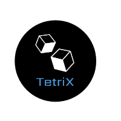
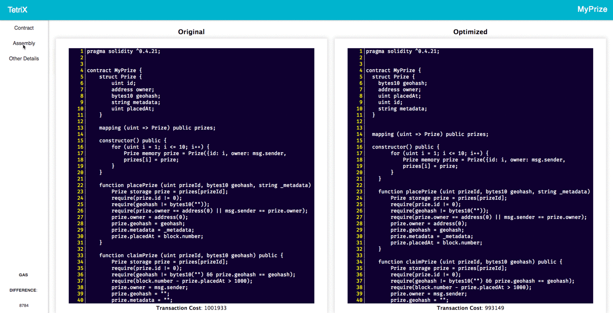

<h1 align="center"></h1>

<p align="center">An optimization tool for lowering your gas costs during <a href="http://solidity.readthedocs.io/en/v0.4.23/" target="_blank">Solidity</a> contract instantiation.</p>

<h4 align="center"><a href="https://google.com"></a>

</h4>

## Why TetriX?
There are three main concerns Ethereum developers have when designing smart contracts: security, accuracy, and cost. We sought to tackle the problem of ***cost*** by creating a tool that automates the reordering of state variables during contract instantiation in order to lower transaction costs. We ensured efficient memory allocation by reorganizing your state variables to take up the minimal amount of storage slots necessary.

## Getting Started

Tetrix is available as the ```tetrix``` package on [npm]("https://www.npmjs.com/") 

Tetrix can be used on any single-contract solidity file. You can optimize contract construction cost with it, but you can also view details about your contract such as ABI, bytecode, opcode and assembly. 

### Prerequisites

To install Tetrix, make sure package.json has been initiated in your project folder. 

More info on how to initiate package.json go [Here](https://docs.npmjs.com/cli/init)

### Installing

To use latest stable version of Tetrix you can install it via npm: 

``` 
$ npm install tetrix 
```

### Usage on the Command-Line

#### Compile Contract and Deploy to Local Virtual Blockchain

To use Tetrix, execute: 
```
$ Tetrix YOUR_SOL_FILE_PATH.sol
```

#### View Contract Detail 

In package.json, include a new script in scripts:
```
"scripts": {
  "tetrixGUI": "webpack --config node_modules/tetrix/webpack.config.js && node node_modules/tetrix/server/server.js"
},
```
then, execute:
```
$ npm run tetrixGUI
```

## Key Features

### Optimize Contract State Variables Memory Allocation

*	Rearranges the Smart Contract state variables in order to allocate the least memory slot possible on the blockchain to optimize gas usage.
	*	Parse through user Smart Contract and detect state variables
	*	Arrange variables based on a 32Bytes memory slot.

###	Create Personal Blockchain Development Environment

*	Compiles user's Smart Contract using Solidity Compiler for retrieving accurate contract information.
*	Deploys user's Smart Contract with [trufflesuite/ganache](https://github.com/trufflesuite/ganache) to avoid the need for paying for the main Ethereum Blockchain

###	Front-End Display of Smart Contract Information

*	Client-side local hosted server (PORT 8080)
<div align="Center">
	
</div>

## Built With

* [React](https://github.com/facebook/react) - Used for Front-end Single Page Application
* [React-Router](https://github.com/ReactTraining/react-router) - Route Management in a Single Page Application
* [Ganache](https://github.com/trufflesuite/ganache) - Local Personal Blockchain Environment
* [Web3](https://github.com/ethereum/web3.js) - Ethereum Javascript API
* [Solc](https://github.com/ethereum/solc-js) - Javascript Solidity Compiler
* [Express](https://github.com/expressjs/express) - Web Framework for node.
* [Webpack](https://github.com/webpack/webpack) - Bundler for javascripts/React


## Contributing

Found a bug? Have a suggestion? Feel free to submit issues!

## Authors

* **Esther Kim** - [https://github.com/choisiesther](https://github.com/choisiesther)

* **Joseph Wu** - [https://github.com/jospehwu1994](https://github.com/josephwu1994)

* **Pauline Chang** - [https://github.com/pskchang](https://github.com/pskchang)

See also the list of [contributors](./docs/CONTRIBUTORS.md) who participated in this project.

## License

This project is licensed under the MIT License

## Acknowledgments
* Support from other open source developers
* And the entire Ethereum developer community
