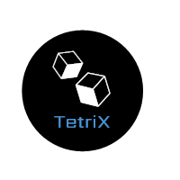

<h1 align="center"></h1>

<p align="center">An optimization tool for lowering your gas costs during for <a href="http://solidity.readthedocs.io/en/v0.4.23/" target="_blank">Solidity</a> contract instantiation.</p>

<h4 align="center"><a href="https://google.com"></a>

</h4>

## Why TetriX?


## Getting Started

Tetrix is available as the ```tetrix``` package on [npm]("https://www.npmjs.com/") 

Tetrix can be used on any single-contract solidity file. You can optimize contract construction cost with it, but you can also view details about your contract such as ABI, bytecode, opcode and assembly. 

### Prerequisites

To install Tetrix, make sure package.json has been initiated in your project folder. 

More info on how to initiate package.json go [Here](https://docs.npmjs.com/cli/init)

### Installing

In the command line:

``` 
npm install tetrix 
```

## Key Features

#### Feature 1:

## Testing

Read the [TESTING.md](./docs/TESTING.md) file for more information on running tests.

## Built With

* [Ethereum](https://vuejs.org/) - The web framework used

## Contributing

Found a bug? Have a suggestion? Feel free to submit issues!

Please read [CONTRIBUTING.md](./docs/CONTRIBUTING.md) for details on our code of conduct and the process for submitting pull requests if you're interesting in contributing to this project!

## Authors

* **Esther Kim** - [https://github.com/choisiesther](https://github.com/choisiesther)

* **Joseph Wu** - [https://github.com/jospehwu1994](https://github.com/josephwu1994)

* **Pauline Chang** - [https://github.com/pskchang](https://github.com/pskchang)

See also the list of [contributors](./docs/CONTRIBUTORS.md) who participated in this project.

## License

This project is licensed under the MIT License - see the [LICENSE.txt](LICENSE.txt) file for details

## Acknowledgments

* Support from other open source developers
* And the entire Ethereum developer community
